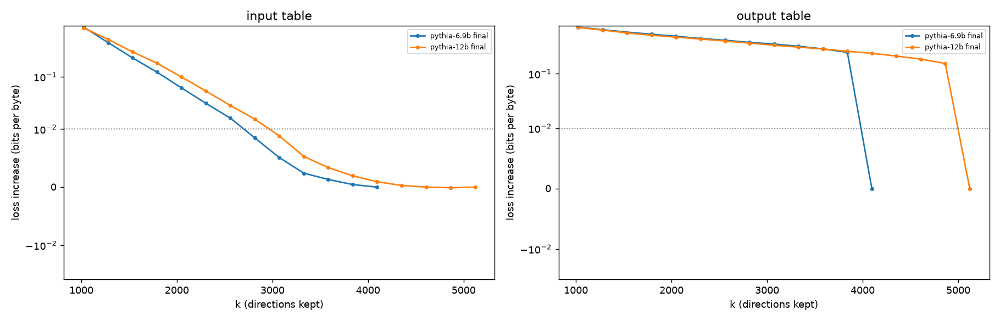
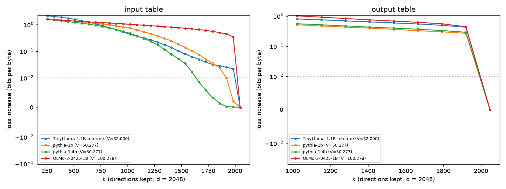

---
# Ariadne working paper 1. Draft until Andrew approves it for publication.
# Source: ariadne pieces/empty-dimensions. Publish with: scripts/publish-piece.sh pieces/empty-dimensions empty-dimensions
title: "Do Language Models Have Empty Dimensions?"
subtitle: "How many embedding directions a fixed vocabulary uses, and what token identity leaves unexplained"
date: 2026-10-09
version: "0.2"
status: working-paper
draft: true
authors:
  - given: Andrew P
    family: Hunter
    orcid: 0009-0005-7613-8019
    affiliation: Plainsight Systems
abstract: |
  A language model's vocabulary size and embedding dimension are chosen
  before training, and training fills in the tables that place each token
  in the embedding space. I wanted to know whether a trained table uses all
  d dimensions of that space. The Pythia suite keeps one 50,277-token
  vocabulary and one training text while d grows from 512 to 5,120, so d
  can vary with the vocabulary held fixed. The trained tables have an
  effective rank of 91 to 98% of d at every size where I computed it (70M
  to 2.8B), so I tested what the network depends on: the number of
  principal directions it needs, within a tolerance on the loss. In the
  input table, the network does not need every direction in the larger
  models: from 1.4B parameters up, the trailing 19 to 40% of the
  directions can be removed together for 0.01 bits per byte. In the output
  table it needs essentially all of them, in every model tested. My
  prediction that the number needed would level off at a value set by the
  vocabulary failed. The trailing input directions carry token-specific
  values, which raised the question of whether they carry the tokens'
  identity. To answer it I used identity information, I(k): how many bits
  about which token was drawn survive, on average, when its table row is
  projected onto the top k principal directions and observed through
  Gaussian noise. Along the ordered directions I(k) is the cumulative mass
  of a measure, and its increments, the bits each direction adds given the
  ones before it, are that measure's density. I then took the noise from
  the model itself, as the part of what its first block adds to a token's
  vector that the token does not determine. At that noise, weighting
  tokens by their frequency in the text and counting in the squash test's
  basis, 99% of a token's identity is in place before the directions the
  network needs, from 410M up: 1,536 against 1,984 directions at 1B, 384
  against 3,072 at 12B. The gap is larger at 6.9B and 12B than at 1B to
  2.8B. Squashing to those directions keeps 99% of identity and costs more
  than 0.1 bits per byte (at 410M, 6.9B and 12B, inferred from the cost at
  the nearest larger measured number of directions). In the two smallest models the gap is not resolved on the measured grid. Counted in
  the text's own frequency-weighted basis, 99% of identity takes 96 to 240
  directions in every model while d grows tenfold. A count from Shannon's
  1949 sphere-packing bound, using the token entropy and the receiver's
  signal-to-noise ratio, does not predict that number better than a
  constant, by a rule set before the measurement. The trailing directions beyond what the network needs at 0.1 bits per byte
  resolve, on their own, most of a token's identity, but, with every token
  counted equally and one random draw per case, no more than a random
  Gaussian code with their variances, so that overlap is not evidence of
  structure the network put there. What the directions the network needs
  beyond identity's carry is the open question. My candidate is the
  grammar: identity counts only the single-token entropy, and a network
  that predicts text must also carry the structure that lowers the entropy
  of the next token given the ones before it. The next step follows Shannon's own method: a
  constructed language, modelled on a toddler's, whose statistics are
  known exactly before any model sees it.
keywords: [embedding dimension, vocabulary, language models, information theory, constellation-constrained capacity, Pythia]
---

## Why ask {#sec:intro}

This paper asks whether a language model's embedding table uses all the dimensions it is given. It is the first entry in Ariadne, a research program working toward an information-theoretic approach to attention and beyond. The program starts where the field started, with Shannon's 1948 paper, and follows one habit of mind: when a number in a model has to be chosen and tuned rather than derived, that is a place where the theory stopped, and it is worth asking why the number is what it is.

The vocabulary is one of those numbers, and the question is older than language models. In the founding paper, next to his definition of redundancy, Shannon set the size of a vocabulary against it: "The Basic English vocabulary is limited to 850 words and the redundancy is very high," while "Joyce on the other hand enlarges the vocabulary and is alleged to achieve a compression of semantic content" [@shannon1948a, p. 399]. The size of a vocabulary was tied to how much a message carries from the start. Shannon did not derive the size, and the vocabularies of today's models are still chosen rather than derived.

A language model makes the question concrete. Its designers choose a vocabulary of \(V\) tokens and an embedding dimension \(d\), and training fills in two \(V \times d\) tables: the input table, whose rows place each token in the network's embedding space, and the output table, whose rows score the network's state against each token. My working idea is that \(V\) and \(d\) together set how much the learned language can express, and that \(d\) should follow from the vocabulary and the grammar. Before running anything I wrote down what that predicts: if \(d\) is chosen by convention rather than derived, then at a fixed vocabulary it will usually be larger than the table needs, and the trained table will leave some of its dimensions empty.

**Terms.** I use a few words in one sense each throughout.

- The **embedding space** is \(\mathbb{R}^d\), where a table's rows \(w_v\) live, and \(d\), its **dimension**, is the number of coordinates in each row. Used alone, "dimension" always means \(d\).
- A **direction** is a unit vector in that space. A table's **principal directions** \(u_1, \dots, u_d\) are the eigenvectors of the covariance of its centered rows, ordered by their eigenvalues \(\lambda_1 \ge \dots \ge \lambda_d\), the **variances** along them. The top \(k\) span a \(k\)-dimensional subspace, and **keeping \(k\) directions** means projecting the rows onto it.
- At a tolerance \(\tau\), the **empty dimensions** are the trailing principal directions \(u_{k^*+1}, \dots, u_d\) that can be removed together without the loss rising by more than \(\tau\), where \(k^*\) is defined in @sec:need. An empty dimension, in the sense of the title, is one of those directions.

This paper reports what I found, in the order I found it. Each stage answered one question and raised the next. Three of those questions needed an instrument of their own: a *test* of how many directions the network depends on; *identity information*, a quantity computed from the table alone that says how many bits of a token's identity its leading directions carry; and a *noise level taken from the receiver*, so that the second instrument stops depending on a choice. What I saw is kept apart from what I make of it at every stage, so a reader can disagree with the reading without losing the observation.

**Models and text.** Most of the work uses the Pythia suite [@biderman2023pythia]: eight models from 70M to 12B parameters, trained on the same data in the same order for about 300B tokens, with one tokenizer of 50,277 tokens. I used the standard run, not the deduplicated one. The embedding dimension takes the values 512, 768, 1,024, 2,048, 2,560, 4,096 and 5,120; depth and the number of attention heads change too. Pythia-1B and Pythia-1.4B share \(d = 2{,}048\) and differ in depth (16 against 24 layers) and in the number of attention heads (8 against 16), which turned out to be a useful control. Their input and output tables are separate parameters, which the code checks. Two other families with \(d = 2{,}048\) appear in @sec:need and @sec:identity: TinyLlama 1.1B [@zhang2024tinyllama], 32,000 tokens (its 3T-token intermediate checkpoint, step 1,431k), and OLMo-2 1B [@olmo2025], 100,278 tokens, alongside Pythia-1B and 1.4B. Vocabulary sizes are the token counts of the released tokenizers; the tables' padding rows are excluded everywhere. Loss is measured on the WikiText-103 test set [@merity2016] in bits per byte, so that models with different tokenizers are comparable: the first 16 windows of 1,024 tokens (16,384 tokens) for the Pythia runs, the first 70,000 characters for the cross-vocabulary runs, the same text at every setting within a comparison. Weights are used in full precision at pinned revisions.

## First look: the tables spread across the space {#sec:spread}

I started with the simplest question: how are the trained rows laid out in the embedding space?

**Effective rank.** Center a table's rows on their mean and take the variances \(\lambda_1 \ge \dots \ge \lambda_d\) along its principal directions. Their square roots are the standard deviations along those directions, and the normalized singular values of the centered table are \(q_i = \sqrt{\lambda_i} / \sum_j \sqrt{\lambda_j}\). The entropy effective rank [@roy2007] is

\[
\operatorname{erank} = \exp\Big(-\sum_i q_i \ln q_i\Big),
\]{#eq:erank}

which runs from 1, all the variance along a single direction, to \(d\), equal standard deviations along all \(d\) directions. Divided by \(d\), it is an effective share of the \(d\) dimensions: 1 when the standard deviations are equal, smaller the more unevenly they are distributed. For reference, a Gaussian table of the same shape, each row scaled to the length of the corresponding centered trained row, reaches 99% or more of \(d\).

**What I saw.** For every Pythia size I computed it for, 70M to 2.8B, both tables have an effective rank of 91 to 98% of \(d\).

**What I made of it.** The vocabulary spreads its variance over nearly every dimension it is given. But variance is cheap: the rows can vary along every direction without the network needing any particular one of them. Effective rank could not tell me whether a direction is used. For that I had to ask the network.

## A test: how many directions the network needs {#sec:need}

### The test

The question is how many principal directions of a table the network actually depends on. I answer it by taking directions away and watching the loss.

Let \(\mu\) be the mean of a table's trained rows and \(U_k = [u_1, \dots, u_k]\) its top \(k\) principal directions. **Squashing** the table onto those directions replaces every row by the mean plus the projection of the centered row onto their span:

\[
w_v^{(k)} = \mu + U_k U_k^{\top} (w_v - \mu).
\]{#eq:squash}

Squash one table, leave the other as trained, run the model on the evaluation text, and record \(L(k)\), the loss in bits per byte. With \(L_0\) the unmodified model's loss, the **directions needed** at tolerance \(\tau\) is

\[
k^*(\tau) = \min\{\, k \in K : L(k) - L_0 \le \tau \,\},
\]{#eq:kstar}

where \(K\) is the set of values of \(k\) in the sweep. The true smallest \(k\) lies above the next-lower point of \(K\) if \(L\) does not increase as \(k\) grows between measured points, which I assume; at the measured points it decreases in every sweep up to \(k^*(0.003)\), and above that the few reversals are under 0.0002 bits per byte. \(d - k^*\) is the number of empty dimensions at that tolerance. The main tolerance is \(\tau = 0.01\) bits per byte; 0.003, 0.03 and 0.1 are reported with it, because the count depends on the tolerance and the tolerance is my choice. The count belongs to one trained network on one text: it says what this network depends on, not what the table could carry.

### What I saw

**The input table has empty dimensions in the larger models.** Up to \(d = 1{,}024\), removing even the weakest 5% of input directions costs more than 0.01 bits per byte, so the network needs more than 95% of them, the finest step of that sweep (@fig:loss; the sweep kept 2, 5, 10, 20 and so on up to 90, 95 and 100% of the directions). From Pythia-1.4B up, the trailing 19 to 40% of the input directions can be removed together for 0.01 bits per byte, from 19% at 1.4B to 40% at 12B (@tbl:need).

{#fig:loss}

| Model | \(d\) | +0.1 | +0.03 | +0.01 | +0.003 | \(k^*/d\) at +0.01 |
|---|---|---|---|---|---|---|
| Pythia-1B | 2,048 | 1,664 | 1,856 | 1,984 | 1,984 | 0.97 |
| Pythia-1.4B | 2,048 | 1,408 | 1,600 | 1,664 | 1,856 | 0.81 |
| Pythia-2.8B | 2,560 | 1,344 | 1,472 | 1,664 | 1,856 | 0.65 |
| Pythia-6.9B | 4,096 | 2,048 | 2,560 | 2,816 | 3,328 | 0.69 |
| Pythia-12B | 5,120 | 2,048 | 2,560 | 3,072 | 3,840 | 0.60 |

: Input directions needed, \(k^*(\tau)\), at four tolerances in bits per byte. Steps of 64 directions for 1B to 2.8B, 256 for 6.9B and 12B. {#tbl:need}

At the same \(d\), the two 2,048-dimensional models differ: Pythia-1B needs 1,984 directions and Pythia-1.4B, deeper and with twice the heads, needs 1,664.

**The output table has no empty dimensions, to within each sweep's step.** At every Pythia size up to 12B, removing the last step of output directions already costs more than 0.01 bits per byte (@fig:loss-large). Dropping the weakest 5% of output directions costs 0.08 to 0.42 bits per byte across Pythia 70M to 2.8B. In the cross-vocabulary comparison below, removing the weakest 128 output directions costs 0.27 to 0.44 bits per byte in all four models; the interpolated counts there, 2,043 to 2,045 of 2,048, fall inside that last step and do not resolve individual directions.

{#fig:loss-large}

**My plateau prediction failed.** I expected the number of input directions needed to level off at a value set by the vocabulary as \(d\) grew. It did not. At 0.01 bits per byte it rises from \(d = 2{,}560\) on: 1,664 at 2,560, 2,816 at 4,096, 3,072 at 5,120, which is 60 to 70% of \(d\) in those three models. At the looser tolerances, 0.1 and 0.03, Pythia-6.9B and 12B need the same number, 2,048 and 2,560 directions, to within the 256-direction steps of that sweep.

**The number needed grows with training.** At Pythia-2.8B's checkpoints, the count at step 1,000, when the table is still close to its random start, is high (1,920 directions at 0.01 bits per byte). After that it rises from 640 directions at step 8,000 to 1,408 at the final step, 143,000, at 0.1 bits per byte, and from 1,408 to 1,664 at 0.01. Between training steps 100,000 and 143,000 it does not change to within the sweep's step of 128 directions.

**At the same \(d\), the largest vocabulary needs essentially every input direction** (@fig:vocab, @tbl:vocab). At 0.1 bits per byte, the 32K and 50K vocabularies need 1,370 to 1,601 of the 2,048 input directions and do not separate from each other; the 100K vocabulary needs more than 1,984, essentially all of them, even at that loose tolerance: removing its weakest 64 input directions costs 0.35 bits per byte, and the 2,030 in @tbl:vocab is interpolated across that last step. These families also differ in training data, length, architecture and recipe, so vocabulary is not the only thing that changes between them.

{#fig:vocab}

| Model | \(V\) | Tokens | In +0.1 | In +0.03 | In +0.01 | Out +0.01 |
|---|---|---|---|---|---|---|
| TinyLlama | 32,000 | 3T | 1,479 | 1,828 | 2,019 | 2,045 |
| Pythia-1B | 50,277 | 300B | 1,601 | 1,821 | 1,921 | 2,043 |
| Pythia-1.4B | 50,277 | 300B | 1,370 | 1,553 | 1,652 | 2,044 |
| OLMo-2 1B | 100,278 | ~4T | 2,030 | 2,042 | 2,046 | 2,045 |

: Directions needed at \(d = 2{,}048\) for the input table (In) and output table (Out), with training tokens, on the first 70,000 characters of the WikiText-103 test set. These counts are interpolated linearly between measured points (input every 64 directions from 256, output every 128 from 1,024), so they differ slightly from @tbl:need, which takes the smallest measured \(k\) on an almost identical span (16,384 tokens against 70,000 characters, both from the start of the test set). OLMo-2's input counts and TinyLlama's at +0.01 fall inside the last measured step below \(d\) and do not resolve individual directions. TinyLlama is the 1.1B model; OLMo-2's training was about 4T tokens. {#tbl:vocab}

### What I made of it

At a fixed vocabulary the input table has empty dimensions in Pythia-1.4B and larger, so the first prediction holds there on the input side; Pythia-1B, TinyLlama and OLMo-2 at the same \(d\) have few or none. The output table has none in any model tested. I leave that as an observation: the output table reads the network's full state, so squashing it tests what that state needs, not what the vocabulary needs. Deleting 30 to 40% of the coordinates of output embeddings, Pythia-2.8B's among them, has been reported to leave generated text acceptable by a MAUVE score above 0.80 [@cho2025]; that test removes coordinate axes rather than principal directions and accepts far more change than 0.01 bits per byte, so the two results are not directly comparable.

That a trained model has removable directions is not new. SliceGPT runs principal component analysis on the activations between blocks and deletes the low-variance directions throughout the network, the embedding dimension included, removing up to 25% of the parameters of Llama-2 70B, OPT 66B and Phi-2 while keeping 99, 99 and 90% of their zero-shot task performance [@ashkboos2024slicegpt]. Pythia's input embeddings have an intrinsic dimension of about 25 to 120 by a nearest-neighbour estimator, far below \(d\) [@kataiwa2025], and with a hub of short rows near the origin removed, a later estimate reads 10 to 17 at each of the six Pythia sizes it measured, 160M to 12B [@quemy2026]. Those are local geometric dimensions of the rows. The directions the network depends on are far more; the directions that carry identity through noise (@sec:identity, @sec:pinned) are 96 to 512, above the trimmed estimate and overlapping the top of the untrimmed one. ALBERT trains models whose input embedding is factorized through a dimension much smaller than the hidden size [@lan2020albert]; the squash test is applied after training, to one table in its own basis. The squash test differs from SliceGPT in purpose and scope: it changes one table, in that table's own basis, and nothing else, and it measures what the trained network depends on rather than compressing it.

The plateau failure matters more to me than the slack. The number of input directions needed is not a property of the vocabulary alone: it rises with \(d\) in the larger models, differs between two models of the same \(d\), and grows with training. The slowdown in new directions late in training looks like the learning-rate schedule rather than the language running out, which is why I parked that thread; it rests on one model and seven checkpoints. The loose tolerances leave one possibility open, a core of directions that levels off while finer detail keeps needing more, and these runs cannot separate the two.

That left me with a question about the trailing directions. The squash test throws them away and records the damage. It does not say what they hold. Maybe their values are **token-independent variance**: variance whose assignment to particular tokens does not matter, which the table kept because nothing pushed it out. Maybe they carry something that belongs to each token.

## What the trailing directions hold {#sec:tail}

### The test

For the input tables of Pythia 1.4B, 2.8B, 6.9B and 12B, call the subspace spanned by the top \(k^*(0.1)\) principal directions the **core**, and the subspace spanned by the remaining \(d - k^*(0.1)\) directions the **tail**. Each centered row \(w_v - \mu\) is the sum of its projection onto the core, its **core component**, and its projection onto the tail, its **tail component**. I changed the tail components in four ways, leaving everything else in the model as trained:

- **zeroed**, which is the squash test at \(k = k^*(0.1)\);
- **shuffled across tokens** by a random permutation, so that almost every token gets another token's whole tail component: the same values and variance, the wrong owner;
- **random**, independent zero-mean Gaussian values with the variance along each tail direction kept;
- **zeroed with lengths kept**, the core component rescaled so each centered row keeps its original length.

As a control, I shuffled the core components across tokens instead. The logic is simple. A shuffled tail keeps the tail's variance and loses only which token each value belongs to. If the tail held only token-independent variance, a shuffled tail should cost no more than deleting it. If a shuffled tail costs more than none, the assignment of values to tokens matters.

### What I saw

| Pythia | Core | As trained | Zeroed | Lengths kept | Shuffled | Random | Core shuffled |
|---|---|---|---|---|---|---|---|
| 1.4B | 1,408 | 0.863 | 0.940 | 0.930 | 0.961 | 0.960 | 3.629 |
| 2.8B | 1,344 | 0.806 | 0.878 | 0.907 | 0.888 | 0.894 | 3.711 |
| 6.9B | 2,048 | 0.777 | 0.838 | 0.824 | 0.899 | 0.888 | 3.826 |
| 12B | 2,048 | 0.744 | 0.844 | 0.821 | 1.032 | 1.047 | 3.570 |

: Loss in bits per byte with the input table's tail components zeroed, zeroed with each centered row's length kept, shuffled across tokens, or replaced by matched random values, and with the core components shuffled instead as a control. Core gives the number of core directions, \(k^*(0.1)\). One shuffle and one random draw per model. {#tbl:tail}

In every model, a wrong tail costs more than no tail: slightly more at 1.4B and 2.8B (0.01 to 0.02 bits per byte), much more at 6.9B and 12B, where zeroing the tail costs 0.10 bits per byte at 12B and shuffling it 0.29 (@tbl:tail). Restoring each centered row's length after zeroing helps in three models and hurts in one, 2.8B. Shuffling the core destroys the model.

I also looked at what the tail separates. For each token that occurs in the evaluation text, I found its nearest neighbour among those tokens by the cosine of their core components, then measured how much adding the tail components pushes the pair apart: core cosine minus full cosine, both of centered rows. Pairs are surface variants if they match after lowercasing and stripping whitespace, and share a stem if they share a prefix of at least four characters covering at least 60% of the shorter one. The tail pushes hardest on pairs that are surface variants of one word, differing only in case or a leading space; less on pairs that share a stem; least on different words. That order holds in every model (Pythia-12B: 0.110, 0.094 and 0.075 in cosine), and the push grows with model size. It also follows how close the pairs start: divided by the mean core cosine of its class, the mean push is about the same or slightly larger for different words (Pythia-12B: 0.24, 0.24 and 0.29). In Pythia-2.8B, the pairs it pushes apart most are punctuation, digits and function words the core places close together (core cosines 0.48 to 0.69): “.” and “,”, “ was” and “ were”, “ the” and “ to”, “ 0” and “ 1”. The quotes show each token exactly, leading space included.

### What I made of it

The tail is not token-independent variance. Its components belong to each token, and wrong values are worse than none, clearly so in the two largest models. In absolute terms it does the most to separate tokens that start out close. That variants of one word start out close is expected: word-form variants, including case, are known to sit near a shared base form plus an additive offset, in both the input and output embeddings [@reif2026vocabdiet]. That suggested an answer I could test: maybe the tail carries identity, the fine distinctions that tell one token from its nearest neighbours.

The squash test could not settle that. It tests what one network depends on, tangled up with everything the network does downstream. I needed a quantity computed from the table on its own: how many bits of *which token this is* its leading directions carry, and how many each further direction adds, whatever reads them.

## Identity information: a measure and its density {#sec:identity}

### The definition

Think of the table as a codebook a sender uses and a receiver reads through noise.

**The codebook.** Tokens \(v\) have rows \(w_v \in \mathbb{R}^d\) in the input or output table. Choose a distribution \(p(v)\) over tokens. In the **dictionary view**, \(p\) is uniform over the vocabulary. In the **text view**, \(p(v)\) is the frequency of \(v\) in a stated text, and the codebook is the tokens that occur there: 3,536 tokens in the 16,384-token text for the Pythia runs with surface-variant classes, and the first 70,000 characters for the other families and for the role runs. Center on \(\mu_p = \sum_v p(v)\, w_v\) and take the principal directions of \(\Sigma_p = \sum_v p(v)(w_v - \mu_p)(w_v - \mu_p)^{\top}\), with variances \(\lambda_1 \ge \dots \ge \lambda_d\). The coordinates of a token's projection onto the top \(k\) are \(x_v^{(k)} = U_k^{\top}(w_v - \mu_p) \in \mathbb{R}^k\). In the dictionary view, \(\mu_p\) and the principal directions are exactly those of the squash test, so the two count directions in the same basis and their counts can be compared. In the text view they are the frequency-weighted ones, a different basis, and until @sec:pinned I compare text-view results only with each other. There I also pair the text view's \(p\) with the squash test's directions, because that is the pairing in which the two counts can be compared on the text the loss is measured on. When \(d\) exceeds the number of tokens that occur, as for Pythia-6.9B and 12B in the text view, \(\Sigma_p\) is singular and, in the frequency-weighted basis, \(I(k)\) stops changing beyond its rank.

**The channel.** Draw a random token \(T \sim p\) and observe the coordinates of its projection through Gaussian noise:

\[
Y_k = x_T^{(k)} + Z, \qquad Z \sim \mathcal{N}(0, \sigma^2 \mathrm{Id}_k), \qquad \sigma = \varepsilon\, s, \qquad s^2 = \operatorname{tr}\Sigma_p / d.
\]{#eq:channel}

Here \(s^2\) is the mean variance per direction, so the **noise scale** \(\varepsilon\) has no units: at \(\varepsilon = 4\), the noise variance is 16 times the mean variance per direction, and larger \(\varepsilon\) means more noise. It is a choice, and every result below states it.

**Identity information** is the mutual information between the token and what the receiver sees in the top \(k\) directions,

\[
I(k) = I(T; Y_k) = H(T) - H(T \mid Y_k) \quad \text{bits}, \qquad I(0) = 0.
\]{#eq:identity}

It is a property of the codebook and \(p\), averaged over tokens, not of any one row.

**The measure and its density.** Because the subspaces are nested and \(I(k)\) never decreases (property 1 below), \(I\) is the cumulative mass of a measure \(m\) on the direction indices \(\{1, \dots, d\}\): \(m(\{j\}) = \Delta I(j)\), \(m(A) = \sum_{j \in A} \Delta I(j)\), and \(m(\{1, \dots, k\}) = I(k)\). Its density with respect to counting measure on the indices is

\[
\Delta I(k) = I(k) - I(k-1) = I\big(T; [Y_k]_k \,\big|\, Y_{k-1}\big),
\]{#eq:density}

the bits the \(k\)-th coordinate of \(Y_k\), written \([Y_k]_k\), adds given the ones before it. The measure and its density carry the same information, one the running sum of the other. Two cautions follow from the definition. Every increment is conditional on the directions before it, so the density depends on the order. And the mass of a set of directions that is not an initial segment is a sum of conditional increments, not the identity information of its span. The exact density is positive for every direction with nonzero variance under \(p\): the posterior given \(Y_{k-1}\) gives every token positive weight, so \(T\) and \([Y_k]_k\) could be independent given \(Y_{k-1}\) only if the \(k\)-th coordinate were the same for every token; an estimated increment can be indistinguishable from zero within its sampling error, the exact one cannot. Over a block of directions the density is reported as \((I(k_b) - I(k_a))/(k_b - k_a)\).

**Ceiling.** A Gaussian input with covariance \(\operatorname{diag}(\lambda_1, \dots, \lambda_k)\) would carry

\[
C(k) = \sum_{i=1}^{k} \tfrac12 \log_2\!\left(1 + \lambda_i / \sigma^2\right)
\]{#eq:ceiling}

bits per use of this channel, the most any input with that covariance can carry; no finite codebook attains it.

**The class split.** Partition the tokens into classes with a function \(g\), \(G = g(T)\). Identity information splits into a **between-class** part \(I_B(k) = I(G; Y_k)\), which class, and a **within-class** part \(I_W(k) = I(T; Y_k \mid G)\), which token within the class. I used two partitions. **Surface variants** put tokens that differ only in case and surrounding whitespace in one class, so “ The”, “The” and “the” share a class. **Grammatical role** uses the 12-tag universal part-of-speech set [@petrov2012] plus a class for whitespace tokens. For the text view, each token type takes the tag it most often receives in context in the first 70,000 characters of the evaluation text, so the class is a function of the token. For the dictionary view, roles come from a lexicon that covers 34 to 48% of each vocabulary; tokens without a known role are left out, and \(\mu_p\), \(\Sigma_p\), its principal directions and \(s\) are recomputed on the covered tokens.

**Which fills first.** The **half-fill point** of each part is the smallest measured \(k\) at which it reaches half of its value in all \(d\) directions:

\[
k_{B,\frac12} = \min\{k : I_B(k) \ge \tfrac12 I_B(d)\}, \qquad k_{W,\frac12} = \min\{k : I_W(k) \ge \tfrac12 I_W(d)\},
\]{#eq:halffill}

over the measured values of \(k\) (8, 16, 32, 64, 128, 256, 384, and so on), so "the same \(k\)" below means the same measured point. If \(k_{W,\frac12} < k_{B,\frac12}\), the table puts its within-class distinctions into its leading directions before its between-class ones. Each part is compared with its own total, so the comparison does not depend on how many bits each part holds.

**Properties.** These hold for the exact quantity; the estimates below carry sampling error on top.

1. \(I(k)\) never decreases in \(k\): the subspaces are nested, so \(Y_k\) is \(Y_{k+1}\) with its last coordinate dropped, and by data processing \(I(T; Y_k) \le I(T; Y_{k+1})\). So the density is never negative.
2. \(I(k) \le H(T) \le \log_2 V\): a receiver cannot learn more than the token's identity.
3. \(I(k) \le C(k)\): \(I(T; Y_k) = h(Y_k) - h(Z)\), \(Y_k\) has covariance \(\operatorname{diag}(\lambda_1, \dots, \lambda_k) + \sigma^2 \mathrm{Id}_k\) because \(\mu_p\) and \(\Sigma_p\) use the channel's own \(p\), and for a given covariance the Gaussian has the largest differential entropy. The same argument holds in any orthonormal basis: if \(\Sigma_k\) is the covariance under \(p\) of the top \(k\) coordinates, \(I(k) \le \tfrac12 \log_2 \det(\mathrm{Id}_k + \Sigma_k / \sigma^2)\), which is @eq:ceiling when the basis diagonalizes \(\Sigma_p\). The gap \(C(k) - I(k)\) is strictly positive whenever \(\lambda_1 > 0\): \(Y_k\) is then a mixture of at least two Gaussians with distinct means and equal covariance, which is not Gaussian (by Cramér's decomposition theorem, if \(Y_k = x_T^{(k)} + Z\) were Gaussian, with \(Z\) Gaussian and independent of \(T\), then \(x_T^{(k)}\) would be Gaussian, and a variable with finitely many values is not Gaussian unless it is constant), so \(h(Y_k)\) is strictly below the Gaussian maximum, which only a Gaussian attains (\(C(k) = I(k) = 0\) if \(\lambda_1 = \dots = \lambda_k = 0\)).
4. The split is exact, \(I(k) = I_B(k) + I_W(k)\), by the chain rule, because \(G\) is a function of \(T\).

**Estimation.** The posterior over tokens is exact for this channel,

\[
p(v \mid y) \propto p(v) \exp\!\left(-\lVert y - x_v^{(k)} \rVert^2 / 2\sigma^2\right),
\]{#eq:posterior}

so \(H(T \mid Y_k)\) is estimated by Monte Carlo: draw a token and a noise vector, form \(y\), and average \(-\log_2 p(T \mid y)\) over draws, evaluating the posterior over every token in the codebook. No probability density function of \(Y\) has to be estimated. Because the posterior is exact, each estimate is unbiased. In this section I used the same 4,000 draws of token and noise at every \(k\) and every \(\varepsilon\), so the estimates are positively correlated across points; @sec:pinned states its own draw counts. The result files record the standard error of each estimate of \(I\) and \(I_B\) (0.04 to 0.07 bits at 64 directions, input tables, dictionary view, \(\varepsilon = 4\)). These errors cover the Monte Carlo draws of token and noise only, not the choice of text, the noise level, \(k^*(\tau)\) or the random codebook used as a baseline. In this section, errors of differences between points, such as block densities, were not computed; in @sec:pinned they are computed from shared draws. Noise scales \(\varepsilon\) = 2, 4 and 8 are reported.

**Where the parts come from.** None of the parts is mine. At a fixed \(k\), in the dictionary view, \(I(k)\) is the mutual information of a \(k\)-dimensional constellation of equiprobable signals on the Gaussian channel, the capacity \(C^*\) of a set of equiprobable discrete signals on the Gaussian channel [@ungerboeck1982, eq. 5], now usually called the constellation-constrained capacity, which that paper evaluates by Monte Carlo; his signal sets are one- and two-dimensional, and the formula extends to \(k\) dimensions unchanged. In the text view it is the mutual information of a constellation with unequal input probabilities, as in probabilistic shaping [@kschischang1993], except that here \(p\) is fixed by the text rather than chosen, and the constellation itself is recomputed under \(p\). The split is the chain rule over set-partition levels that multilevel coding rests on [@wachsmann1999]; there the classes are part of the code's design, here they are imposed by what counts as the same word. The ceiling has the log-determinant form of the coding rate in maximal coding rate reduction [@yu2020mcr], and adding noise to make mutual information meaningful for a deterministic map follows @goldfeld2019. Probing has treated what a representation reveals about a linguistic property as mutual information [@pimentel2020] and has asked how few dimensions of an embedding carry it [@torrobahennigen2020]; identity information differs in fixing the channel, Gaussian noise at a stated level, and in reading the codebook itself rather than a trained probe. What may be new, as far as my search found, is sweeping the quantity over the number of principal directions kept, reading it as a measure along those directions with a density per direction, comparing how fast the parts fill, and pointing all of it at a model's embedding table; that search was not exhaustive, and the half-fill comparison was not searched separately. Ordering the directions by variance is itself a choice. In word embeddings, how much syntactic information a principal component carries does not track the variance it explains [@raunak2020]; and in a related setting, precoding for channels with discrete inputs, the optimal precoder is generally not diagonal in the channel's eigenbasis, and its power allocation need not follow the eigenvalues [@perezcruz2010].

### What I saw

**At the main noise scale, the leading directions carry nearly all of a token's identity.** At \(\varepsilon = 4\), dictionary view, the Pythia input tables carry 6 to 14 of their 15.6 bits of token identity in their top 64 directions (@fig:identity). In the models from 1B up, \(I(k)\) reaches 99% of \(I(d)\) by 256 to 384 directions, and \(I(d)\) is within 0.03 bits of \(H(T)\); the squash test, in the same basis, needs 1,664 to 3,072. Pythia-70M and 160M reach 99% only at all \(d\) of their directions, and Pythia-410M at half of them. The count depends on the noise scale: at \(\varepsilon = 2\), half of the identity sits in the top 8 to 32 directions; at \(\varepsilon = 8\), the models from 1B up need 1,280 to 1,792 input directions to reach 99%, and the smallest table, Pythia-70M's, carries only about a third of \(H(T)\) even in all \(d\) directions.

{#fig:identity}

**The input table carries more identity than the output table in its leading directions:** at \(\varepsilon = 4\), dictionary view, the top 64 directions carry 9.5 against 7.2 bits at 1B and 14.3 against 9.2 at 12B.

**Case and spacing fill before the word.** With surface-variant classes, the within-class part, which variant of a word, reaches half its value in all \(d\) dimensions before the between-class part, which word, in 78 of 96 cases (eight models, two tables, two views, three noise scales), at the same measured \(k\) in the other 18, and never later. The order holds in TinyLlama and OLMo-2 as in Pythia.

**In running text, role fills before the word.** With grammatical-role classes, in the text view, the role reaches half its value before the word within the role in 53 of 60 cases (ten models, two tables, three noise scales), at the same measured \(k\) in the other 7, and never later. At \(\varepsilon = 4\), role is half-filled by 8 to 16 directions (32 for OLMo-2's input table) and the word within the role by 32 to 64. In the dictionary view there is no consistent order: role first in 11 cases, tied in 27, word first in 22. These role results are in the text-view and role-dictionary bases, not the squash test's, so I do not compare them with the directions the network needs.

### What I made of it

At \(\varepsilon = 4\), the tail adds essentially no identity beyond what the leading directions already carry. In the squash test's own basis, the leading few hundred directions hold nearly all of \(H(T)\) in the models from 1B up, while the network depends on 1,664 to 3,072, and the tail components are token-specific. So the tail holds something that belongs to each token and is not needed, beyond the core, to tell tokens apart at that noise.

Three things limited what that said, and each became a measurement. First, the result depended on the noise. At \(\varepsilon = 8\), where the core resolves less, the estimated density is visibly nonzero further out, past the 1,664 directions Pythia-2.8B needs, though its error was not computed. A result that holds at a chosen noise scale is not yet a property of the model. Second, the share of the measure beyond \(k^*(\tau)\) is conditional: \(I(d) - I(k^*(\tau)) = I\big(T; [Y_d]_{k^*(\tau)+1..d} \mid Y_{k^*(\tau)}\big) \le H(T \mid Y_{k^*(\tau)})\), where \([Y_d]_{a..b}\) is coordinates \(a\) to \(b\) of \(Y_d\), and at \(\varepsilon = 4\) the core already resolves almost all of \(H(T)\), so the measure gives the tail almost nothing whatever it holds. Identity the tail carries redundantly, a copy of what the core already resolves, is invisible to this ordered measure. Third, the comparison with the squash test was made in the dictionary view, where every token counts equally, while the loss is measured on text, where frequent tokens dominate.

The two views disagreeing is a finding of its own. The text view weights each token by how often the source produces it, which is the distribution Shannon's information is defined over, and there the tables give a clean order, role before word. Counted over the dictionary, they do not.

## The receiver's noise {#sec:pinned}

### The noise from the receiver

The noise scale was the weakest link, so I replaced it with noise measured from the model. I defined it before computing any value with it, and the definition was committed to the repository before the computation. A language model reads its input table only through the residual stream. At the input to the second block, a reader sees the token's row \(w_{v_t}\) plus what the first block added at that position, \(a_t = h_1(t) - w_{v_t}\), where \(h_1(t)\) is the residual stream after the first block. The first block's addition depends on the context as well as the token, and the part of it that the token does not determine is interference for a reader trying to recover which token it is. I define

\[
\sigma_{\text{res}}^2 = \frac{1}{d}\operatorname{tr}\big(\text{pooled within-token covariance of } a_t\big),
\]{#eq:sigmares}

the variance per coordinate of \(a_t\) around its mean for the same token, pooled over the token types that occur at least twice in the evaluation text, and use \(\sigma = \sigma_{\text{res}}\) in the channel of @eq:channel. Write \(s_u\) for the scale \(s\) of @eq:channel with \(p\) uniform over the vocabulary, the full table's scale; in this section \(\varepsilon\) means \(\sigma / s_u\) unless stated otherwise.

The definition rests on assumptions. Four were stated before computing: the context-driven part of the first block's output is treated as noise for identity, although it carries context; it is approximated as isotropic and Gaussian, although it is neither; only the first block is counted, and the definition said that later blocks would add more, so that this would be the least residual-stream interference; and it comes from one text. I have since weakened the third: this is the interference a reader at the second block's input faces, the first block reads the row with none, and later readers face a cumulative addition that I did not measure and that need not be larger. Two more belong with them. One noise level is used for every token, although the pooled estimate is dominated by frequent tokens and is also applied in the dictionary view, where every token counts equally. And the codebook stays the table's rows \(w_v\), although a reader at the second block sees \(w_v + \mathbb{E}[a_t \mid v_t = v]\); from the total and within-token variances of \(a_t\), that token-determined addition has a spread per coordinate of about 7.7 to 20.5 times \(s_u\), far larger than the table's own. So the identity measured here is the table's, read through the interference a second-block reader faces, not the identity of what that reader receives. A related variance, of hidden states at the penultimate layer across contexts that share the same next token, has been read the other way, as information a representation stores rather than noise [@abrahao2026]; that grouping is by the predicted token, not the input token, and here the context-driven part is interference only for a reader whose task is the input token's identity. Input tokens are known to keep much of their identity through a transformer's layers, at least in BERT [@brunner2020identifiability]; the question here is narrower.

Two reference levels sit beside it. The tables are stored in 16-bit floating point. If the error between the trained values and the stored ones is spread evenly over one unit in the last place, its variance on an entry \(w\) is \(\operatorname{ulp}(w)^2/12\), where \(\operatorname{ulp}(w)\) is the spacing of representable values near \(w\). Its mean over the table is a reference for how finely the stored table can represent a distinction, not noise that any reader of it faces. And if a reader's input could contain another token's row, drawn uniformly and centered on the table's mean, at equal strength, the noise variance per coordinate, averaged over coordinates, would be \(s_u^2\), which is \(\varepsilon = 1\) by definition.

**What I saw.** Residual-stream interference gives \(\varepsilon_{\text{res}}\) of 2.2 to 2.7 for Pythia-70M to 410M and 3.5 to 4.2 from 1B up, so the \(\varepsilon = 4\) I had chosen was in the range the models set. Counting the part of \(a_t\) that the token does determine as well gives 8.1 to 20.8. The 16-bit level is \(\varepsilon = 2.1 \times 10^{-4}\), at which every table resolves 99% of identity in its top 8 directions, in both views. In the dictionary view at \(\sigma_{\text{res}}\), identity reaches 99% by 128 to 512 directions in all eight models.

### Identity against the network, on the text

The comparison that matters pairs what the squash test counts with what identity needs, on the same text and in the same basis. So I took \(p\) from the token frequencies of the evaluation text, kept the squash test's directions, and held the noise at the same absolute \(\sigma_{\text{res}}\). The last point needs care: the text view's own scale, \(s_t\), is 8 to 10% smaller than \(s_u\) (\(s_t / s_u\) = 0.900 to 0.923), so the same \(\sigma\) is \(\varepsilon\) = 2.39 to 4.67 in the text view's terms. The text view has 3,536 token types and \(H(T) = 9.43\) bits, and \(I(d)\) at \(\sigma_{\text{res}}\) is at least 99.8% of it in every model. Let \(k_{q}\) be the smallest measured \(k\) with \(I(k) \ge q\, I(d)\); I report \(q\) = 0.95, 0.99 and 0.999, because the cut is my choice. The decision rule, set before the run, was that the gap holds for a model if \(k_{0.99}\) is at least one measured point below \(k^*(0.01)\). Each estimate used 4,000 draws, raised to 16,000 for 410M and 64,000 for 2.8B and 6.9B where \(k_{0.99}\) was not two standard errors clear of the neighbouring measured point; in the frequency-weighted basis, to 16,000 for 160M and 12B. At 64,000, Pythia-2.8B's \(k_{0.99}\) is still unresolved between 768 and 1,024.

| Pythia | \(d\) | \(k_{0.95}\) | \(k_{0.99}\) | \(k_{0.999}\) | \(k^*(0.01)\) | \(I(d) - I(k_{0.99})\), bits |
|---|---|---|---|---|---|---|
| 70M | 512 | 384 | 512 | 512 | 512 (all) | 0 |
| 160M | 768 | 384 | 768 | 768 | 768 (all) | 0 |
| 410M | 1,024 | 128 | 384 | 768 | 1,024 (all) | 0.041 ± 0.003 |
| 1B | 2,048 | 768 | 1,536 | 1,984 | 1,984 | 0.072 ± 0.008 |
| 1.4B | 2,048 | 512 | 1,024 | 1,536 | 1,664 | 0.050 ± 0.006 |
| 2.8B | 2,560 | 384 | 768 to 1,024 | 1,536 | 1,664 | 0.092 ± 0.002 (at 768) |
| 6.9B | 4,096 | 256 | 512 | 1,280 | 2,816 | 0.068 ± 0.002 |
| 12B | 5,120 | 256 | 384 | 768 | 3,072 | 0.075 ± 0.007 |

: Directions identity needs, text view, squash-test basis, at the receiver's noise \(\sigma_{\text{res}}\), against the directions the network needs at 0.01 bits per byte (@tbl:need). "All": the sweep, in steps of 5 to 10% of \(d\), needed more than 95% of the directions, and \(k^*\) is taken as \(d\). \(H(T) = 9.43\) bits. ± is one standard error over the Monte Carlo draws. {#tbl:pinned}

The gap holds from 410M up. By the rule it does not hold in 70M and 160M, though both counts fall in the last grid step there and a small gap is not excluded: identity's 99% point on this text is not reached before the last measured point below \(d\) (384 of 512 directions; 512 of 768), and the network needs more than 95% of the directions (@tbl:pinned). Both counts sit on grids, so their ratio is known only to an interval: \(k^*(0.01)/k_{0.99}\) lies in \((1.25, 1.55)\) at 1B, \((1.56, 2.17)\) at 1.4B, \((1.56, 3.25)\) at 2.8B, \((5.0, 7.3)\) at 6.9B and \((7.3, 12)\) at 12B, and is above 2.5 at 410M, where \(k^*\) is known only to exceed 973. The gap is larger at 6.9B and 12B than at 1B to 2.8B; among 1B to 2.8B, the 1.4B and 2.8B intervals overlap and 1B's lies below both, and 1B and 1.4B share \(d\) and differ in depth and heads. At 1B the gap depends on the cut: \(k_{0.999}\) equals \(k^*(0.01)\). The largest estimate of \(I(d) - I(k^*(0.01))\) is 0.0093 ± 0.0028 bits (1B).

Squashing the input table to \(k_{0.99}\) directions costs more than 0.1 bits per byte in every model from 410M up. At 1B to 2.8B, \(k_{0.99}\) lies below \(k^*(0.1)\) (@tbl:need). At 410M, keeping 410 directions already costs 0.70 bits per byte; at 6.9B and 12B the sweep starts at 1,024 directions, which already cost 0.89 and 0.86. Assuming the loss keeps rising as directions are removed below the measured points, as it does throughout every measured sweep, the smaller \(k_{0.99}\) costs at least as much.

**The basis matters.** In the frequency-weighted basis, on the same text at the same noise, \(k_{0.99}\) is 128 to 256 in all eight models on this grid, and 96 to 240 on a finer one (@tbl:nflat), against 384 to 1,536 in the squash test's basis.

### Shannon's count

Shannon counted dimensions too, those of the channel. In "Communication in the Presence of Noise" he represented signals as points in a space of \(n = 2TW\) dimensions and bounded how many of them can be told apart through white Gaussian noise: at most \(\big(\sqrt{(P+N)/N}\,\big)^{n}\), with \(P\) and \(N\) the average signal and noise power, an argument for many dimensions and vanishing error [@shannon1949, p. 17, eq. 21]. Turned around, telling \(M\) signals apart needs about \(2\log_2 M / \log_2(1 + P/N)\) of the channel's dimensions. The nearest analogue for an embedding table puts the table's mean variance per direction, \(s^2\), in place of \(P\), the receiver's noise in place of \(N\), and the token entropy in place of \(\log_2 M\):

\[
n_{\text{flat}} = \frac{2\, H(T)}{\log_2\!\big(1 + 1/\varepsilon^2\big)}, \qquad \varepsilon = \sigma_{\text{res}} / s,
\]{#eq:nflat}

with \(s\) the view's own scale (\(s_u\) in the dictionary view, \(s_t\) in the text view). Putting \(H(T)\) in place of \(\log_2 M\) is not Shannon's step for unequal probabilities; what @eq:nflat is exactly is the \(k\) at which the Gaussian ceiling @eq:ceiling of a table whose every principal direction had variance \(s^2\) reaches \(H(T)\). It uses the token entropy and the ratio of the receiver's noise to the table's mean variance, and \(d\) enters it only through that mean. It is not a bound for these tables, whose leading directions carry more than the mean variance. The counting form is not new: the same volume argument bounds the dimension that embedding-based retrieval needs, with a margin in place of noise and the number of \(k\)-subsets in place of the number of messages [@weller2026, sec. 3, thm. 1], and the dimension of word embeddings has been chosen from their signal against estimation noise [@yin2018]. Random projections in the manner of Johnson and Lindenstrauss also give a count of order \(\log V\) that does not grow with \(d\) [@johnson1984], but for preserving distances to a stated distortion, not for telling tokens apart through a stated noise. What I test here is whether the count predicts the directions identity needs.

A bound that does hold comes from each table's own spectrum. By property 3, the smallest \(k\) with \(C(k) \ge 0.99\, I(d)\), which I call \(k_C\), is a lower bound on the exact \(k_{0.99}\), up to the Monte Carlo error in \(I(d)\). \(C(k)\) itself is an exact function of the table and \(\sigma_{\text{res}}\), computed at every \(k\) from 1 to \(d\).

On the grid of @tbl:pinned, seven of the eight frequency-weighted cut points fall in the same interval, 129 to 256 directions, which cannot tell the count from a constant. So I measured the cut points again on a grid of 16 directions, from 16 to 512, in the text view's frequency-weighted basis, the primary test, and in the dictionary view, with the same estimator, seed and precision check; draws were raised to 16,000 or 64,000 where the 99% cut was not two standard errors clear of its neighbour. The rule was committed before the run: the count agrees for a model if \(0.8 \le n_{\text{flat}} / k_q \le 1.25\), and it carries information beyond a constant only if its mean \(\lvert \ln(n_{\text{flat}} / k_q) \rvert\) over the eight models is below that of the best single constant.

**What I saw.**

| Pythia | \(d\) | \(n_{\text{flat}}\), text | \(k_{0.95}\) | \(k_{0.99}\) | \(k_{0.999}\) | \(n_{\text{flat}}\), dictionary | \(k_{0.99}\), dictionary |
|---|---|---|---|---|---|---|---|
| 70M | 512 | 122 | 112 | 160 | 272 | 174 | 256 |
| 160M | 768 | 117 | 96 | 144 | 224 | 161 | 208 |
| 410M | 1,024 | 81 | 64 | 96 | 144 | 115 | 112 |
| 1B | 2,048 | 291 | 160 | 240 | 352 | 393 | 384 |
| 1.4B | 2,048 | 248 | 128 | 208 | 336 | 350 | 304 |
| 2.8B | 2,560 | 267 | 112 | 176 | 288 | 374 | 240 |
| 6.9B | 4,096 | 202 | 96 | 144 | 224 | 281 | 144 |
| 12B | 5,120 | 220 | 96 | 144 | 208 | 306 | 128 |

: Shannon's count against the directions identity needs at \(\sigma_{\text{res}}\), on a grid of 16 directions. \(k_{0.95}\), \(k_{0.99}\) and \(k_{0.999}\): text view, frequency-weighted basis, \(H(T) = 9.43\) bits. Dictionary view: \(H(T) = 15.62\) bits. The 99% cut did not separate from its neighbour at 64,000 draws at 70M and 6.9B (text) and 160M (dictionary). {#tbl:nflat}

Shannon's count fails the rule. In the primary test, \(n_{\text{flat}} / k_{0.99}\) runs from 0.76 to 1.53 and is inside the band in four models (160M, 410M, 1B, 1.4B), but its mean log error, 0.274, is larger than the 0.199 of the best single constant, any value from 144 to 160 directions (@tbl:nflat). A version of the count rescaled by a fitted factor also loses to the constant (0.230 against 0.199), so the failure is in how the count varies between models, not only in its scale. It also fails at the 95% and 99.9% cuts and in the dictionary view, where at 99% it ties the constant (0.352 against 0.352) and at 99.9% the cut points of 1B, 1.4B and 2.8B lie beyond the grid's 512 and are set to \(d\). What the finer grid does show is the measurement itself: on the text, in its own basis, 99% of a token's identity takes 96 to 240 directions in every model, while \(d\) grows tenfold, from 512 to 5,120. The capacity bound is 7.6 to 24 times below it in that basis and 2.7 to 3.6 times below it in the dictionary view.

**What I made of it.** The number of directions identity takes, counted this way, stays within 96 to 240, a factor of 2.5, while \(d\) grows tenfold, so its share of \(d\) falls from about 31% to 3%. The simplest count, from the token entropy and the ratio of the receiver's noise to the table's mean variance, does not predict it better than a constant, so for now it is a number I can measure and not one I can derive. Read after the fact, and not by the rule, which tested how the count varies between models: in the primary test the count gets the scale right with no parameter fitted to the identity measurements, between 0.76 and 1.53 times the measured count in every model, while the constants that beat it, 144 to 160 directions, were fitted to those measurements. The bound from each table's own spectrum, also with nothing fitted, is 7.6 to 24 times too small in that basis. So the count falls between two simple pictures: spreading the table's mean variance evenly over its directions gives about the right number, and the table's real variances, as a Gaussian code could use them, give far too few. Why it sits between 96 and 240 directions, and what sets the differences between models, is open.

### Does the tail duplicate the core?

The second limit was that identity the tail carries redundantly, a copy of what the core resolves, is invisible to the ordered measure. So I measured the tail on its own, with the core and tail of @sec:tail (the core is the top \(k^*(0.1)\) directions, the tail the rest), in the dictionary view, with \(\sigma = \varepsilon s_u\). Let \(Y_{\text{core}}\) and \(Y_{\text{tail}}\) be the coordinates in those directions plus independent Gaussian noise. Given the token they are independent, so the identity both resolve is their **shared information**,

\[
R = I(T; Y_{\text{core}}) + I(T; Y_{\text{tail}}) - I(T; Y_d) = I(Y_{\text{core}}; Y_{\text{tail}}) \ge 0.
\]{#eq:shared}

At \(\varepsilon_{\text{res}}\) the tail alone resolves 10.4 of 15.6 bits at 1.4B, 14.0 at 2.8B and all of it at 6.9B and 12B, and \(R\) is within 0.01 bits of that: nearly all of it is identity the core already resolves. The overlap is forced, not made. Exactly, \(I(T; Y_{\text{tail}}) - R = I(T; Y_{\text{tail}} \mid Y_{\text{core}}) \le H(T) - I(T; Y_{\text{core}})\), which at \(\varepsilon_{\text{res}}\) is at most 0.033 bits with surface-variant classes (0.053 with role classes), so \(R \approx I(T; Y_{\text{tail}})\) whatever the tail holds. And how much the tail resolves is bounded by its variances. In the dictionary view the tail's coordinates are principal coordinates under the same uniform \(p\), so their covariance is \(\operatorname{diag}(\lambda_{k+1}, \dots, \lambda_d)\), and the proof of property 3 applies to any set of principal directions: \(I(T; Y_{\text{tail}}) \le \min\big(H(T), C_{\text{tail}}\big)\), with \(C_{\text{tail}}\) @eq:ceiling summed over the tail's directions. At \(\varepsilon_{\text{res}}\), \(C_{\text{tail}}\) is 11.3, 18.5, 57.5 and 83.5 bits in the four models, and at 1.4B, where it is below \(H(T)\), the tail resolves 92% of it. A code drawn at random with the tail's variances does as well: with surface-variant classes, in one draw per case, it resolves slightly more identity than the true tail wherever the tail does not already resolve the token (at \(\varepsilon_{\text{res}}\), 10.79 against 10.42 bits at 1.4B and 14.26 against 13.98 at 2.8B). With grammatical-role classes, where the codebook is the role tokens but the random code keeps the variances over all tokens, the true tail resolves slightly more in several cases (10.43 against 10.35 bits at 1.4B, \(\varepsilon_{\text{res}}\); 5.11 against 4.84 at 2.8B, \(\varepsilon = 8\)). In the surface view, the unconditional measure finds nothing in the tail's identity that a random code with its variances would not also show.

### What I made of it

At the noise a second-block reader faces, on the text the loss is measured on, and in the squash test's basis, the network depends on more input directions than token identity needs, in every Pythia model from 410M up, and the gap is larger at 6.9B and 12B than at 1B to 2.8B. The directions between \(k_{0.99}\) and \(k^*(0.01)\) add under 1% of identity on this text, at most 0.092 of 9.43 bits, yet squashing to \(k_{0.99}\) costs the network more than 0.1 bits per byte. Under this noise model, those directions add under 1% of identity beyond the directions before them; whether they duplicate identity the leading directions already carry, which a reader that is not Bayes-optimal might use, was not measured.

The copy the ordered measure could not see is there, but with every token counted equally it is the kind any code with the tail's variances would show, so it is not evidence of structure the network put in the tail. By analogy with Shannon's redundancy, and not by his definition, under which a uniform source over the vocabulary has none [@shannon1948a]: in the dictionary view, \(H(T) = 15.62\) bits is 9 to 20% of the core's Gaussian ceiling \(C_{\text{core}}\) at \(\sigma_{\text{res}}\) (78 to 168 bits), so \(1 - H(T)/C_{\text{core}}\) is 80 to 91% and that ceiling exceeds what identity needs by a factor of 5 to 11.

The basis result is a caution for this paper and for anyone ordering an embedding table's directions by variance. In the frequency-weighted basis, identity on this text needs 96 to 240 directions in every model; in the vocabulary-wide basis it needs 2.7 to 6.4 times as many at the measured points (the squash-basis points are on a coarser grid). As I read it, directions ordered by variance over all 50,277 tokens are ordered largely by tokens the text rarely uses. That frequency weighting matters to an embedding space's geometry is known: most methods for correcting that geometry implicitly assume uniform word frequencies, and PCA whitening weighted by the empirical frequencies improves task performance over them [@yokoi2024]. The squash test removes directions in that order, so its counts carry the same dependence.

## Where this leaves me {#sec:interp}

**What held.** At a fixed vocabulary, the input table has empty dimensions in the larger models. The output table has none, which I leave as an observation. At the noise a second-block reader faces, the network depends on more input directions than token identity needs, from 410M up, by a margin larger at 6.9B and 12B (5 to 12 times, on the 99% cut) than at 1B to 2.8B (1.25 to 3.25 times). And the directions identity needs, counted in the text's own basis, stay within 96 to 240 at the 99% cut while \(d\) grows tenfold.

**What failed.** The number of directions needed is not set by the vocabulary alone. It grows with \(d\) in the larger models and with training, and differs between models of the same \(d\). And Shannon's count, from the token entropy and the ratio of the receiver's noise to the table's mean variance, does not predict the directions identity needs better than a constant.

**What I ruled out.** The trailing directions are not token-independent variance: their values belong to their tokens, clearly at 6.9B and 12B; at 1.4B and 2.8B the margins rest on one draw each. And their overlap with the core in identity, in the surface view, shows nothing a random code with the tail's variances would not: the core's resolution forces the overlap, and the tail's variances bound how much it can be.

**The open question.** What does the network use the directions between \(k_{0.99}\) and \(k^*\) for, if not to tell tokens apart? Nothing here has tested that block directly. My candidate is the grammar. Identity information treats each token as an independent draw from \(p\). In the text view the entropy it accounts for is the single-token entropy, the token analogue of Shannon's \(F_1\); in the dictionary view it is \(\log_2 V\), the analogue of his \(F_0\). In "Prediction and Entropy of Printed English", \(F_N\) is the entropy of the next letter given the \(N - 1\) before it, and as \(N\) grows it approaches the entropy of the language [@shannon1951, p. 51, eqs. 1 and 2]. A network that predicts text has to carry what \(F_1\) leaves out: what each token does to the state that the next prediction depends on. The directions beyond identity's are where I would look for it first. The first alternative is plain bigram statistics: in trained models of up to 1B parameters, subnetworks that predict the next token from the current one alone are concentrated in the first MLP layer and remain critical to performance even below 0.2% of the parameters [@chang2025]. A test of the grammar hypothesis has to separate what a token does to the state from what it predicts on its own. A related result bounds the question from the other side: a 1.7B-parameter model whose input table is replaced by fixed 16-bit token codes, chosen without reference to the language, trains to a working model, below a learned-table control on several evaluations [@bochkov2026]. Whatever the learned table adds beyond identity is part of that control's margin. The other candidates remain open, and I have tested none of them: graded similarity, how alike two tokens are rather than whether they differ, and the network's reliance on exact values rather than on distinctions. The basis result adds another way to be wrong: the directions are counted in an order set by the whole vocabulary, and a different order could change which directions look needed.

## Limits {#sec:limits}

- **Mostly one model family, one text.** The Pythia suite and the WikiText-103 test set carry most of the results; two other families appear at one size, and they differ in more than vocabulary.
- **Chosen tolerances and cuts.** Every count from the squash test depends on the loss tolerance, and every count of directions identity needs depends on the share of identity required; I report 95, 99 and 99.9%, and at 1B the gap closes at 99.9%. Results at \(\varepsilon\) = 2, 4 and 8 are at a chosen noise relative to each table's own mean variance per direction: identity information does not change if a table is translated, rotated or rescaled, so those are comparisons at matched relative noise.
- **The receiver's noise is an approximation.** \(\sigma_{\text{res}}\) treats the context-driven part of the first block's output as noise although it carries context, approximates it as isotropic and Gaussian although it is neither, counts only the first block, and comes from one text. It is the interference a reader at the second block's input faces; later readers' interference was not measured and may be larger or smaller. It keeps the table's rows as the codebook although that reader sees them shifted by a token-determined addition far larger than their own spread.
- **A linear test along one basis.** The squash test removes principal directions linearly, in the order of variance over the whole vocabulary, and in the frequency-weighted basis identity needs far fewer directions (@sec:pinned). A network might depend on structure that a different basis or a nonlinear compression would keep in fewer dimensions.
- **Coarse steps and short text.** The larger models were swept in steps of 256 directions; the Pythia runs read 16,384 tokens and the cross-vocabulary runs 70,000 characters, and the cross-vocabulary counts are interpolated between measured points. For Pythia-70M to 410M the squash sweep needed more than 95% of the directions, its finest step, so their \(k^*\) is taken as \(d\). Pythia-2.8B's \(k_{0.99}\) is unresolved between 768 and 1,024 even at 64,000 draws.
- **One draw for the loss.** The tail tests on the loss use one shuffle and one random draw per model, so the small margins at 1.4B and 2.8B have no error bars. The random-code comparison for the tail's identity is one draw.
- **When the rules were set.** The definition of the receiver's noise has its own commit before any value was computed with it. The decision rule for the text-view run was written before running but committed with the results, so its order cannot be checked from the history. The rule for Shannon's count was committed before its fine-grid run; the coarse-grid comparison that prompted it was made after the coarse values were known.

## Next: a toddler's language {#sec:next}

Shannon did not start from English. He built it up from constructed sources whose statistics he knew, and he modelled the transmitter and the receiver as finite-state transducers with "a finite number \(m\) of possible states", proving that a non-singular one keeps the source's entropy rate exactly [@shannon1948a, sec. 8, p. 399; Theorem 7, p. 400]. Ariadne will follow the same method.

The models I probed learned languages too advanced to start from. Even the difference between "was" and "were" is advanced. A two-year-old's language is not, and I live with one. My daughter uses "bubble" for about five different things, a vocabulary smaller than the world it names, which developmental linguists call overextension [@rescorla1980]. And whenever something changes hands, she says "here you go". She learned it from me saying "here you go" and her name when I handed her things. Now she says it whether she is giving or receiving, and when she is the one receiving she fills the name in with whoever is handing it to her: "here you go da da." As I read it, she did not learn a rule about who receives. She learned a frame attached to the event of handing something over, with a slot for the other person. Early word combinations built around a fixed word or phrase with an open slot are well documented [@braine1963; @lieven1997; @tomasello2003]. Hers is a small, exact example of how a frame's meaning can differ from the meaning of the sentence it came from.

The next experiment came from watching her, and its tools come from developmental linguistics as much as from information theory. It builds a language like hers on purpose: a small world of people, objects and actions; a vocabulary smaller than the world, with controlled overextension; a handful of frames with slots; and known probabilities. I will design it as a unifilar finite-state source, one whose state is determined by its start and the words so far, so that its entropy rate, its states and the information each word carries about the world are exact before any model sees it. I will check identity information first on a toy product codebook, with independent coordinates under \(p\) (uniform over the corners of a box with distinct side lengths, say) and isotropic noise, so that its identity information is a sum of one-dimensional terms, each computable by quadrature to any precision, then train tiny models and simple counters on the language and see whether the dimension they need follows from the vocabulary and the grammar. In that language both halves are known before training: the identity information of its vocabulary's codebook, and the grammar's states and \(F_N\). The question becomes whether the number of directions a receiver needs splits into a part set by the first and a part set by the second, and whether the directions beyond both stay empty.

Two earlier results bear on that test. On languages generated by known probabilistic automata, the rank of the generating automaton has a stronger effect on how well models learn the language than the number of states or symbols does [@borenstein2024]. And for a receiver with \(m\) states testing between two hypotheses on independent observations with a time-invariant rule, the lowest long-run error any such machine can approach has been known in closed form since 1970: \(1/(1 + \gamma^{(m-1)/2})\) with equal priors, where \(\gamma\), assumed finite, is the ratio of the supremum to the infimum of the likelihood ratio [@hellman1970], a derived answer for one kind of finite receiver.

## What this paper does not claim {#sec:claims}

- That a natural embedding dimension has been found. The plateau prediction failed.
- A theory of how networks work. Ariadne follows the "why is it this way" question from receivers where proofs are tractable.
- That identity information is new. Its parts are established (@sec:identity).
- That the tail holds no identity. On its own it resolves most of it, within its Gaussian ceiling; it adds almost none beyond the core at the receiver's noise.
- That the directions the network needs beyond identity's hold nothing. They matter to the loss; what they hold is the open question.
- That they hold the grammar. It is my candidate, and nothing here tests it.
- That the directions identity needs have been derived. They have been measured; Shannon's count, the simplest derivation I tried, fails the rule set for it.
- That removable directions are new. SliceGPT and intrinsic-dimension work found slack first (@sec:need).
- Generality beyond what was tested: mostly one model family, one text, and tolerances that I chose and have stated.

## Data and code {-}

Every run, script, pinned model revision and result file is in the Ariadne repository, <https://github.com/plainsight-systems/ariadne>, under `experiments/c-empty-dimensions/` (at commit `7be7a6a`), including the numbered observations this paper draws on (1 to 44; it does not use all of them). The paper itself is in the same repository, under `pieces/empty-dimensions/`. Identity information and the receiver's noise are also defined there, in `definitions.md` (sections 1 and 1.10), with the prior-art search for identity information. The ideas behind the experiment are recorded in `ideas.md`.

## References {-}

::: {#refs}
:::
